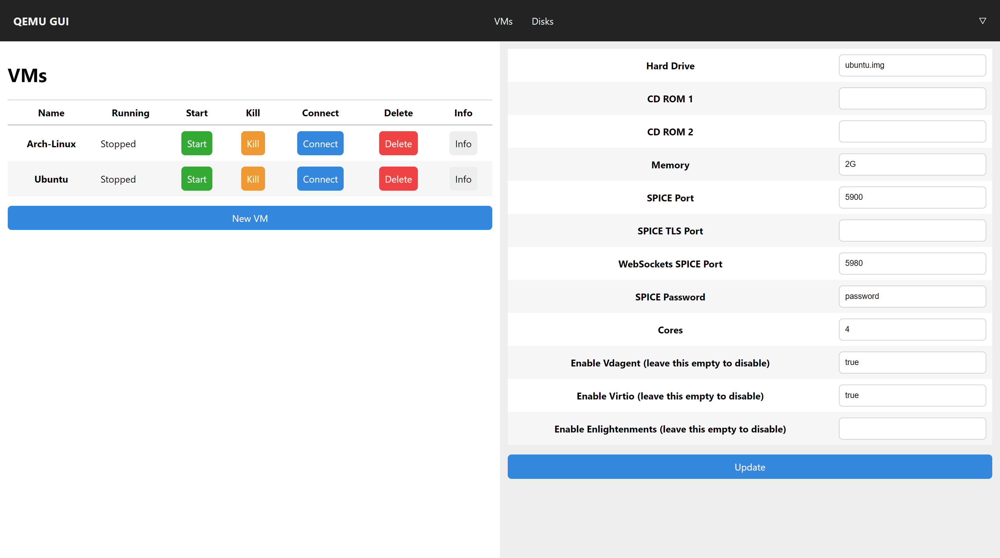

# qemu-gui

A web-based QEMU interface

This project is designed to be run on a local server and allows a client to connect and spin up KVM accelerated virtual machines. This program has only very basic support for some features of QEMU. A client can upload ISOs and create raw disk images on the server, and they can configure a virtual machine using these disks. The server also hosts a (very bad) SPICE over WebSockets client. A port can be set so a real SPICE client can be used.

## Installation Instructions

The whole program can be run under a docker container. So just install docker, clone the repo, and add TLS keys and passwords. 

For TLS keys, you'll need to copy them to the server and change the paths to them in `server.js` (they're in quite a few places). If you're not using Let's Encrypt, you'll also need to edit the Docker Compose file to bind-mount a different path. **There is also a variable called `tls` that you can set to false to disable TLS (for development or for lazy people).**

For the password (used for HTTP authentication to the web page), create a file called `keys.json` in the root of the cloned repository that looks something like this:
    {"key":"Basic abcdefghijklmnop"}
where `abcdefghijklmnop` is the Base64 encoding of `username:password`.

Finally, run `sudo docker-compose up` to start the server.

## Building Instructions

Clone the repository (make sure to use `--recurse-submodules` to clone the SPICE client).

Run `npm run dev` to start a development server, or `npm start` for a production server.
